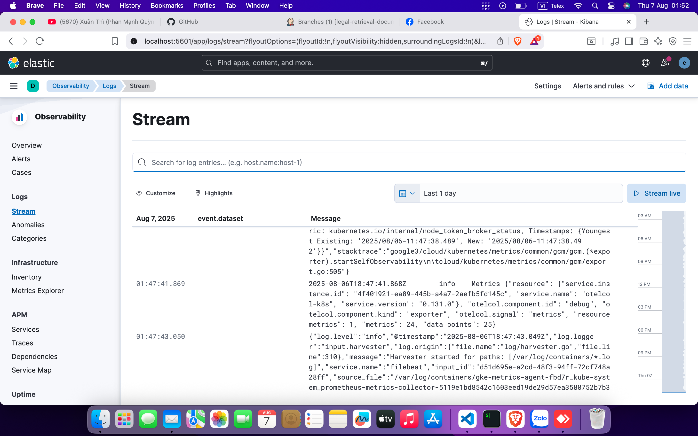

# Legal Document Retrieval System with MLOps

A production-ready legal document retrieval system built with modern MLOps practices, deployed on Google Kubernetes Engine (GKE).

## Table of Contents
- [Overview](#overview)
- [System Architecture](#system-architecture)
- [Prerequisites](#prerequisites)
- [Infrastructure Setup](#infrastructure-setup)
  - [GKE Cluster Setup with Terraform](#gke-cluster-setup-with-terraform)
  - [CI/CD Pipeline with Jenkins](#ci-cd-pipeline-with-jenkins)
- [Component Deployment](#component-deployment)
  - [Nginx Ingress Controller](#nginx-ingress-controller)
  - [Vector Database (Qdrant)](#vector-database-qdrant)
  - [Legal Chatbot](#legal-chatbot)
- [Observability Stack](#observability-stack)
  - [Logging (ELK Stack)](#logging-elk-stack)
  - [Monitoring (Prometheus & Grafana)](#monitoring-prometheus-grafana)
  - [Tracing (Jaeger & OpenTelemetry)](#tracing-jaeger-opentelemetry)
- [Development](#development)
  - [Building Multi-Architecture Images](#building-multi-architecture-images)

## Overview

[Add a brief description of your project here]

## System Architecture

<div align="center">
  
  <p><em>High-level architecture of the Legal Document Retrieval System</em></p>
</div>

## Prerequisites

- Google Cloud Platform account
- `gcloud` CLI installed and configured
- Docker installed
- Helm v3.x
- kubectl configured
- Terraform installed

## Infrastructure Setup

### GKE Cluster Setup with Terraform

1. Authenticate with GCP:
```bash
gcloud auth application-default login
```

2. Initialize and apply Terraform:
```bash
cd iac/terraform
terraform init
terraform plan
terraform apply
```

### CI/CD Pipeline with Jenkins

<div align="center">
  
  <p><em>Jenkins CI/CD Pipeline Architecture</em></p>
</div>

1. Create Service Account and prepare credentials:
   - Create a Service Account with Compute Admin role
   - Generate JSON key and store in `iac/ansible/secrets`

2. Deploy Jenkins server:
```bash
ansible-playbook iac/ansible/deploy_jenkins/create_vm.yaml
ansible-playbook -i iac/ansible/inventory iac/ansible/deploy_jenkins/deploy_jenkins.yaml
```

3. Configure SSH access:
```bash
ssh-keygen
# Copy the ssh-keys value from Metadata
```

4. Access Jenkins:
   - URL: http://<EXTERNAL_IP>:8081
   - Get initial password:
```bash
ssh <USERNAME>@<EXTERNAL_IP>
sudo docker exec -it jenkins-server bash
cat /var/jenkins_home/secrets/initialAdminPassword
```

5. Install required plugins:
   - Docker
   - Docker Pipeline
   - Kubernetes
   - Google Kubernetes Engine

6. Configure credentials:
   - Set up Docker Hub credentials (ID: dockerhub)
   - Configure GKE service account credentials

## Component Deployment


### Nginx Ingress Controller

```bash
kubectl create ns nginx-ingress
kubens nginx-ingress
helm upgrade --install nginx helm_chart/nginx-ingress
```

<div align="center">
  
  <p><em>Nginx Ingress Controller Architecture</em></p>
</div>


### Vector Database (Qdrant)

```bash
kubectl create ns vectordb
kubens vectordb
helm repo add qdrant https://qdrant.github.io/qdrant-helm
helm repo update
helm install qdrant qdrant/qdrant
helm upgrade -i qdrant helm_charts/qdrant
```

<div align="center">
  
  <p><em>Qdrant Vector Database Service Architecture</em></p>
</div>


### Legal Chatbot

```bash
kubectl create ns model-serving
kubens model-serving
kubectl create secret generic legal-secret --from-env-file=src/lawbot/.env -n model-serving
helm upgrade --install legal-chatbot helm_charts/legal_chatbot
```

<div align="center">
  
  <p><em>Legal Chatbot Service Architecture</em></p>
</div>

## Observability Stack


### Logging (ELK Stack)

<div align="center">
  
  <p><em>ELK Stack components and data flow</em></p>
</div>

Centralized logging is essential for monitoring and troubleshooting applications deployed on Kubernetes. This section guides you through setting up an ELK stack (Elasticsearch, Logstash, Kibana) with Filebeat for logging your GKE cluster.

0. Quick run

You can use this single helmfile script to kick off the ELK stack:

```bash
cd helm_charts/elk
helmfile sync
```

1. Install ELK Stack with Helm

We will use Helm to deploy the ELK stack components:

- Elasticsearch: Stores the logs.
- Logstash: Processes and filters the logs.
- Kibana: Provides a web UI for visualizing and searching logs.
- Filebeat: Collects logs from your pods and forwards them to Logstash.

First, create a namespace for the logging components:

```bash
kubectl create ns elk
kubens elk
```

Next, install Elasticsearch:

```bash
helm install elk-elasticsearch elastic/elasticsearch -f helm_charts/elk/elastic.expanded.yaml --namespace elk --create-namespace
```

Wait for Elasticsearch to be ready:

```bash
echo "Waiting for Elasticsearch to be ready..."
kubectl wait --for=condition=ready pod -l app=elasticsearch-master --timeout=300s
```

Create a secret for Logstash to access Elasticsearch:

```bash
kubectl create secret generic logstash-elasticsearch-credentials \
  --from-literal=username=elastic \
  --from-literal=password=$(kubectl get secrets --namespace=elk elasticsearch-master-credentials -ojsonpath='{.data.password}' | base64 -d)
```

Install Kibana:

```bash
helm install elk-kibana elastic/kibana -f helm_charts/elk/kibana.expanded.yaml
```

Install Logstash:

```bash
helm install elk-logstash elastic/logstash -f helm_charts/elk/logstash.expanded.yaml
```

Install Filebeat:

```bash
helm install elk-filebeat elastic/filebeat -f helm_charts/elk/filebeat.expanded.yaml
```

2. Access Kibana:

Expose Kibana using a service and access it through your browser:

```bash
kubectl port-forward -n elk svc/elk-kibana-kibana 5601:5601
```

Please use this script to get the Kibana password:

```bash
kubectl get secrets --namespace=elk elasticsearch-master-credentials -ojsonpath='{.data.password}' | base64 -d
```

<div align="center">
  
  <p><em>Kibana components and data flow</em></p>
</div>

### Monitoring (Prometheus & Grafana)

<div align="center">
  
  <p><em>Prometheus and Grafana Monitoring Architecture</em></p>
</div>

1. Create Discord webhook:

First, create a Discord webhook. Go to the Discord website and click on Server Settings. Click on Integrations. Click on Create Webhook. Enter a name for your webhook (e.g. easy-llmops-discord-webhook) and click on Create. Copy the webhook URL.

2. Configure Helm Repositories

First, we need to add the necessary Helm repositories for Prometheus and Grafana:

```bash
helm repo add prometheus-community https://prometheus-community.github.io/helm-charts
helm repo add grafana https://grafana.github.io/helm-charts
helm repo update
```

These commands add the official Prometheus and Grafana Helm repositories and update your local Helm chart information.

3. Install Dependencies

Prometheus requires certain dependencies that can be managed with Helm. Navigate to the monitoring directory and build these dependencies:

```bash
helm dependency build ./deployments/monitoring/kube-prometheus-stack
```

4. Deploy Prometheus

Now, we'll deploy Prometheus and its associated services using Helm:

```bash
kubectl create namespace monitoring
helm upgrade --install -f deployments/monitoring/kube-prometheus-stack.expanded.yaml kube-prometheus-stack deployments/monitoring/kube-prometheus-stack -n monitoring
```

This command does the following:

- `helm upgrade --install`: This will install Prometheus if it doesn't exist, or upgrade it if it does.
- `-f deployments/monitoring/kube-prometheus-stack.expanded.yaml`: This specifies a custom values file for configuration.
- `kube-prometheus-stack`: This is the release name for the Helm installation.
- `deployments/monitoring/kube-prometheus-stack`: This is the chart to use for installation.
- `-n monitoring`: This specifies the namespace to install into.

By default, the services are not exposed externally. To access them, you can use port-forwarding:

For Prometheus:

```bash
kubectl port-forward -n monitoring svc/kube-prometheus-stack-prometheus 9090:9090
```

Then access Prometheus at [http://localhost:9090](http://localhost:9090)

For Grafana:

```bash
kubectl port-forward -n monitoring svc/kube-prometheus-stack-grafana 3000:80
```

Then access Grafana at [http://localhost:3000](http://localhost:3000)

The default credentials for Grafana are usually:

- Username: admin
- Password: prom-operator (you should change this immediately)


<div align="center">
  
  <p><em>Granfana UI Components</em></p>
</div>

5. Test Alerting

First we need to create a sample alert. Navigate to the monitoring directory and run the following command:

```bash
kubectl port-forward -n monitoring svc/alertmanager-operated 9093:9093
```

Then, in a new terminal, run the following command:

```bash
curl -XPOST -H "Content-Type: application/json" -d '[
  {
    "labels": {
      "alertname": "DiskSpaceLow",
      "severity": "critical",
      "instance": "server02",
      "job": "node_exporter",
      "mountpoint": "/data"
    },
    "annotations": {
      "summary": "Disk space critically low",
      "description": "Server02 has only 5% free disk space on /data volume"
    },
    "startsAt": "2023-09-01T12:00:00Z",
    "generatorURL": "http://prometheus.example.com/graph?g0.expr=node_filesystem_free_bytes+%2F+node_filesystem_size_bytes+%2A+100+%3C+5"
  },
  {
    "labels": {
      "alertname": "HighMemoryUsage",
      "severity": "warning",
      "instance": "server03",
      "job": "node_exporter"
    },
    "annotations": {
      "summary": "High memory usage detected",
      "description": "Server03 is using over 90% of its available memory"
    },
    "startsAt": "2023-09-01T12:05:00Z",
    "generatorURL": "http://prometheus.example.com/graph?g0.expr=node_memory_MemAvailable_bytes+%2F+node_memory_MemTotal_bytes+%2A+100+%3C+10"
  }
]' http://localhost:9093/api/v2/alerts
```

This command creates a sample alert. You can verify that the alert was created by running the following command:

```bash
curl http://localhost:9093/api/v2/status
```

<div align="center">
  
  <p><em>Alert Discord Bot</em></p>
</div>

### Tracing (Jaeger & OpenTelemetry)

<div align="center">
  
  <p><em>Jaeger and OpenTelemetry Tracing Architecture</em></p>
</div>

```bash
kubectl create ns tracer
kubens tracer
helm repo add jaegertracing https://jaegertracing.github.io/helm-charts

helm repo update
helm search repo jaegertracing/jaeger

helm upgrade --install jaeger jaegertracing/jaeger \
     --namespace tracer \
     --create-namespace \
     --history-max 3 \
     --values helm_charts/tracer/jaeger.yaml


helm repo add open-telemetry https://open-telemetry.github.io/opentelemetry-helm-charts
helm repo update
helm install otel-collector open-telemetry/opentelemetry-collector \
     --namespace tracer \
     --create-namespace \
     --values helm_charts/tracer/otel.yaml \
     --set image.repository="otel/opentelemetry-collector-k8s"
```
